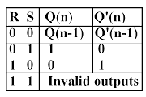
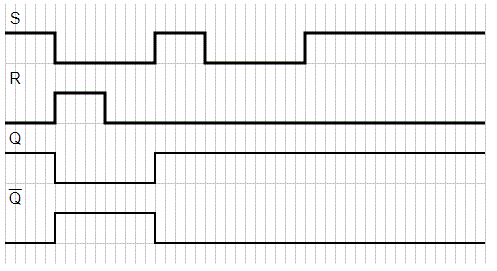

### Introduction

Latches are basic storage elements that operate with signal levels (rather than signal transitions). Latches controlled by a clock transition are flip-flops. Latches are edge-sensitive devices. Latches are useful for the design of the asynchronous sequential circuit.  

SR (Set-Reset) Latch – SR Latch is a circuit with:  
(i) 2 cross-coupled NOR gates or 2 cross-coupled NAND gates. 
(ii) 2 inputs S for SET and R for RESET. 
(iii) 2 outputs Q, Q.
  
The SR Latch using NOR gate is shown below with its truth table:    

  <b> Figure-1:Logic Symbol of NOR gate latch</b> 
 <b> Figure-2:Truth Table of NOR gate latch</b>
  

   

While the R and S inputs are both low, feedback maintains the Q and Q outputs in a constant state, with Q the complement of Q. If S (Set) is pulsed high while R (Reset) is held low, then the Q output is forced high, and stays high when S returns to low; similarly, if R is pulsed high while S is held low, then the Q output is forced low, and stays low when R returns to low.The R = S = 1 combination is called a restricted combination or a forbidden state because, as both NOR gates then output zeros, it breaks the logical equation Q = Q. The combination is also inappropriate in circuits where both inputs may go low simultaneously (i.e. a transition from restricted to keep). The output would lock at either 1 or 0 depending on the propagation time relations between the gates (a race condition).  

  
       
<b>Figure-3:Timing Diagram of NOR gate latch</b>
 

